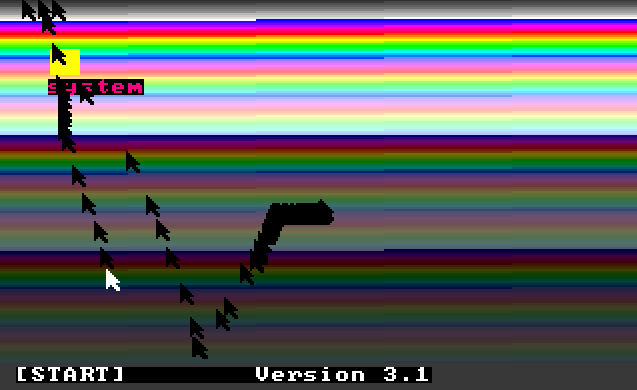
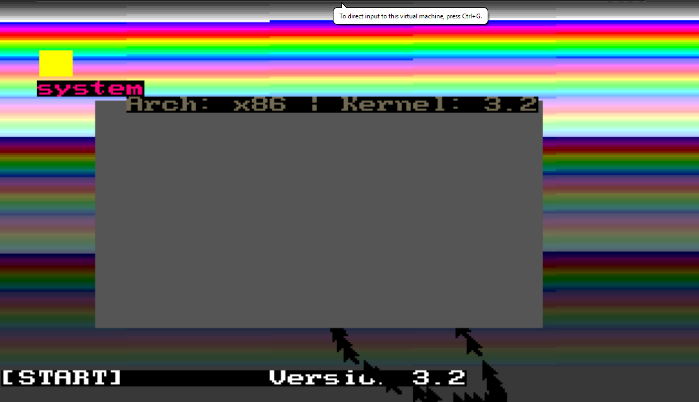
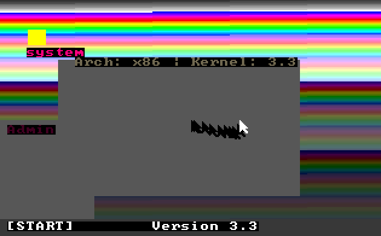

# MITOCHONDRIONOS.   

## System version

### 🌟 MitochondrionOS 1.0
Is some breaked  

### 🌟 MitochondrionOS 2.0
Have a comand for close programs [B]  

### 🌟 MitochondrionOS 2.1
We added a glitched cursor  

### 🌟 MitochondrionOS 3.0
We added a click system  

### 🌟 MitochondrionOS 3.1
Added MitochondrionOS 1.0/2.0 labels, folder system icon back, changed wallpaper, changed taskbar color (yes) 

### 🌟 MitochondrionOS 3.2
Added a about window and reboot/shutdown systems 

### 🌟 MitochondrionOS 3.3
Added a Network driver (is a poorly driver)

## HOW TO USE
B: close programs
N: notepad
C: Prompt comand
M: Start menu
R: reboot machine
P: shutdown computer
A: open a fetch
(Click in 'START' text to open Start Menu too)
